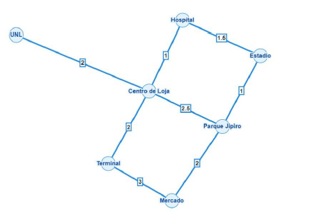

#  Evidencia: Modelado de la Red de Transporte de Loja

En esta práctica se realizó la abstracción y modelado de un sistema de movilidad real correspondiente a la ciudad de Loja, utilizando software especializado (*Graph Online / Gephi*).

El objetivo fue representar la topografía vial mediante un grafo ponderado y no dirigido, buscando minimizar el cruce de aristas para obtener una interpretación visual clara.

---

---

###  Propiedades Estructurales Analizadas:
*   **Vértices (Nodos):** Representan puntos críticos de la urbe (UNL, Terminal, Centro de Loja, Hospital, Parque Jípira, Estadio, Mercado).
*   **Aristas (Conexiones):** Corredores viales principales que conectan dichos puntos.
*   **Pesos:** Distancias o tiempos estimados entre cada locación.

---
[⬅️ Volver a la Fase 1](../README.md)
