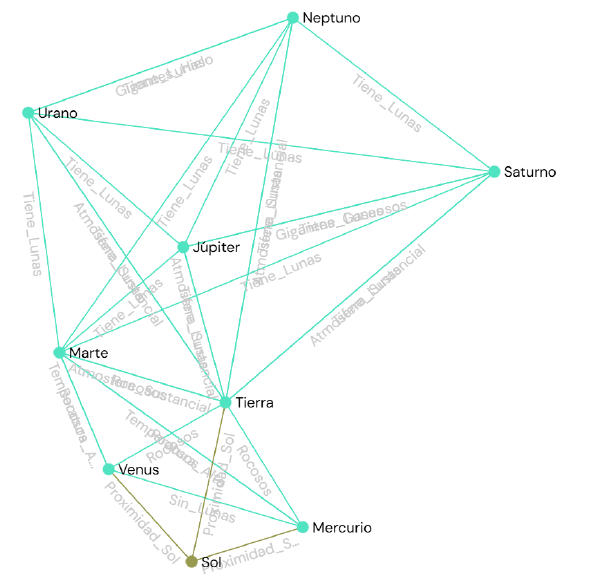

# 🪐 Evidencia: Grafo del Sistema Solar

Este fue el modelado inicial donde los nodos representan los cuerpos celestes y las aristas dictan las conexiones o relaciones espaciales entre ellos. Para que el computador pueda procesar esta red, acompañamos el gráfico con su respectiva **Matriz de Adyacencia**.

---

---
[⬅️ Volver a la Fase 1](../README.md)
