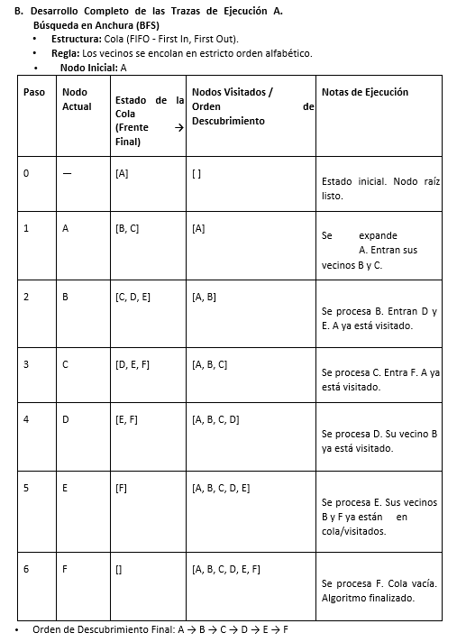
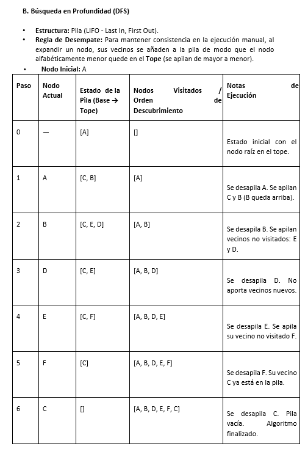
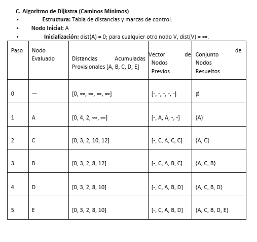

# ✍️ Evidencias: Desarrollo Completo de las Trazas de Ejecución Manual

En esta sección se detalla el análisis iterativo paso a paso de los algoritmos aplicados sobre los grafos de prueba establecidos.

---

##  A. Búsqueda en Anchura (BFS)
* **Grafo Utilizado:** No Dirigido (Nodos: A, B, C, D, E, F).
* **Estructura de Memoria:** Cola (FIFO - *First In, First Out*).
* **Nodo Inicial:** A.

* **Orden de Descubrimiento Final:** $A \rightarrow B \rightarrow C \rightarrow D \rightarrow E \rightarrow F$

---

##  B. Búsqueda en Profundidad (DFS)
* **Estructura de Memoria:** Pila (LIFO - *Last In, First Out*).
* **Nodo Inicial:** A.

* **Orden de Descubrimiento Final:** $A \rightarrow B \rightarrow D \rightarrow E \rightarrow F \rightarrow C$

---

##  C. Algoritmo de Dijkstra (Caminos Mínimos)
* **Grafo Utilizado:** Ponderado No Dirigido.
* **Estructura:** Tabla de distancias y marcas de control para la relajación de aristas.

---
[⬅️ Volver a la Fase 2](../README.md)
