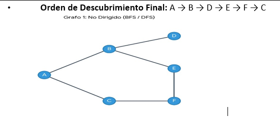
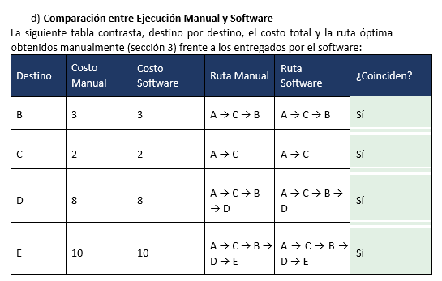

#  Evidencias: Modelado mediante Software y Comparación de Resultados

Para validar la precisión del cálculo manual, el Grafo 2 se modeló de forma idéntica en herramientas de software especializado (*Graph Online / Python NetworkX*).

---

##  Representación Gráfica del Árbol de Caminos Mínimos
El software resalta en azul el árbol de caminos mínimos óptimos calculados desde el nodo origen **A**:

---

##  Comparación entre Ejecución Manual y Software

Al contrastar destino por destino el costo total y la ruta óptima arrojada por ambos métodos, se evidencia una **coincidencia absoluta (100%)**.

###  Análisis de la Comparación:
* **Coincidencia total:** Valida que la lógica de la traza manual del algoritmo de Dijkstra se ejecutó de forma correcta.
* **Valor del proceso manual:** Pese a la rapidez del software, el desarrollo manual sigue siendo indispensable para comprender el funcionamiento interno del algoritmo (relajación de aristas y actualización de distancias/padres).

---
[⬅️ Volver a la Fase 2](../README.md)
