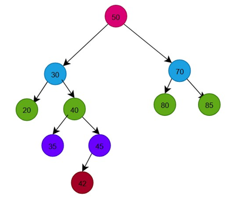
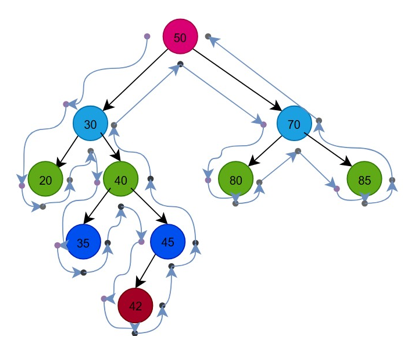
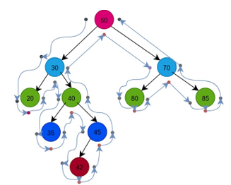
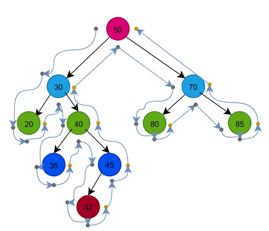
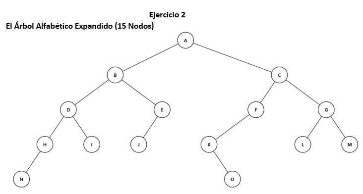
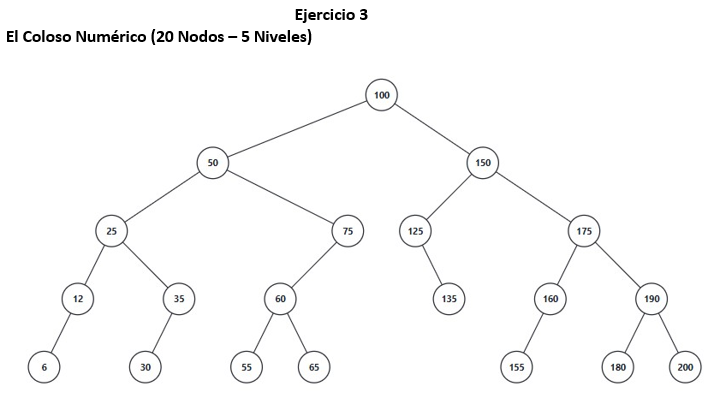

#  Evidencias Prácticas: Diseño y Recorrido de Estructuras Arbóreas

Este módulo detalla la construcción manual iterativa y el análisis topológico de Árboles Binarios de Búsqueda (BST) a partir de conjuntos de datos específicos.

---

##  Ejercicio 1: El Colapso del Sistema de Inicio de Sesión
* **Caso de Uso:** Optimización de indexación de IDs numéricos únicos para evitar cuellos de botella en una plataforma de autenticación masiva.
* **Datos de Entrada:** `[50, 30, 70, 20, 40, 80, 35, 45, 85, 42]`

###  Estructura del Árbol Final
Aplicando la propiedad fundamental del BST (valores menores a la izquierda, valores mayores a la derecha del nodo padre), se obtiene la siguiente topología optimizada:

---

##  Análisis de Recorridos Lineales
Para evaluar la estructura y consistencia del árbol, se trazaron los tres recorridos principales utilizando puntos de guía perimetrales:

### 1. Recorrido Preorden (Raíz - Izquierda - Derecha)
* **Propósito:** Útil para la clonación, serialización o exportación exacta del árbol a archivos planos sin perder la jerarquía original.
* **Secuencia Resultante:** $PRE = \{50, 30, 20, 40, 35, 45, 42, 70, 80, 85\}$

### 2. Recorrido Inorden (Izquierda - Raíz - Derecha)
* **Propósito:** Permite recuperar y listar los elementos en un orden estrictamente ascendente (de menor a mayor) sin costo computacional de ordenamiento externo.
* **Secuencia Resultante:** $IN = \{20, 30, 35, 40, 42, 45, 50, 70, 80, 85\}$

### 3. Recorrido Postorden (Izquierda - Derecha - Raíz)
* **Propósito:** Estándar de la industria para algoritmos destructores (liberación de memoria física de abajo hacia arriba evitando nodos huérfanos) y traducción de operaciones matemáticas (notación polaca inversa).
* **Secuencia Resultante:** $POST = \{20, 35, 42, 45, 40, 30, 85, 80, 70, 50\}$

---

##  Ejercicio 2: El Árbol Alfabético Expandido (15 Nodos)
Diseño de una estructura balanceada utilizando claves de caracteres para evaluar la profundidad del subárbol izquierdo y derecho.

* **Preorden:** $A, B, D, H, N, I, E, J, C, F, K, O, G, L, M$
* **Inorden:** $N, H, D, I, B, J, E, A, K, O, F, C, L, G, M$
* **Postorden:** $N, H, I, D, J, E, B, O, K, F, L, M, G, C, A$

---

##  Ejercicio 3: El Coloso Numérico (20 Nodos - 5 Niveles)
Validación extrema de inserción y balanceo sobre un árbol con raíz $100$.

* **Preorden:** $100, 50, 25, 12, 6, 35, 30, 75, 60, 55, 65, 150, 125, 135, 175, 160, 155, 190, 180, 200$
* **Inorden:** $6, 12, 25, 30, 35, 50, 55, 60, 65, 75, 100, 125, 135, 150, 155, 160, 175, 180, 190, 200$
* **Postorden:** $6, 12, 30, 35, 25, 55, 65, 60, 75, 50, 135, 125, 155, 160, 180, 200, 190, 175, 150, 100$

---
[⬅️ Volver al Menú de la Fase 3](../README.md)
